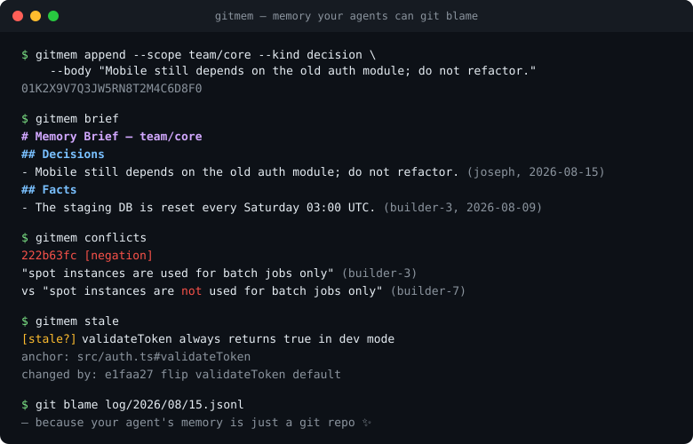
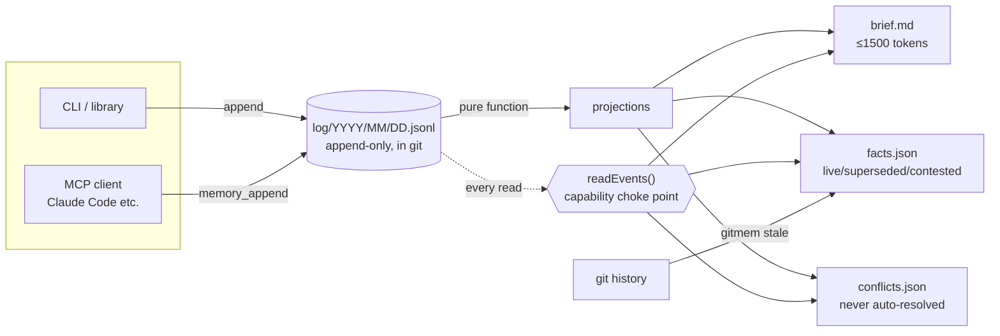

# gitmem

**Persistent, reviewable memory for your AI agents — in a git repo you can read, diff, and blame.**

[](https://github.com/josephy02/gitmem/actions/workflows/ci.yml)
[](LICENSE)


Your coding agent forgets everything between sessions. gitmem gives it an append-only event log of facts, decisions, and corrections, stored as plain JSONL in git, with deterministic projections: a token-budgeted **brief** to inject into context, a current-facts view, and a conflict queue that surfaces contradictions instead of silently overwriting them.

No vector store. No LLM calls. No server. A memory system you can `git log`.

<p align="center"></p>

## Installation

Install from npm:

```bash
npm install -g gitmem
```

Or, if you are developing or setting up the Claude Code plugin, clone the repository and install it locally:

```bash
git clone https://github.com/josephy02/gitmem.git
cd gitmem
npm install   # builds automatically
npm link      # puts `gitmem` on your PATH
```

Verify the install:

```bash
gitmem --help
```

## 60-second quickstart

```bash
gitmem init --root ./memory

gitmem --root ./memory append --scope team/core --kind decision \
  --body "Mobile still depends on the old auth module; do not refactor." \
  --author human:joseph

gitmem --root ./memory append --scope team/core \
  --body "The staging DB is reset every Sunday 03:00 UTC." \
  --author agent:builder-3

gitmem --root ./memory brief         # the context bootstrap, capped at 1,500 tokens
gitmem --root ./memory facts --json  # current-value view, NDJSON
gitmem --root ./memory conflicts     # contradictions, surfaced never auto-resolved
gitmem --root ./memory commit        # git commit of the log, on your cadence
```

Or explore the bundled demo — 45 realistic events with corrections, a retraction, a promotion, and a live conflict:

```bash
gitmem --root /tmp/demo init
gitmem --root /tmp/demo append --json --force - < demo/events.ndjson
gitmem --root /tmp/demo brief
```

## How it works



1. **The log is the only source of truth.** One event per line in `log/YYYY/MM/DD.jsonl`. Nothing is ever mutated or deleted — corrections and retractions are new events that supersede old ones, so provenance is always reconstructible (`gitmem trace <id>`).
2. **Projections are pure functions of the log.** `facts.json` (current values with live/superseded/retracted/expired/contested status), `brief.md` (the always-injected core, hard-capped at 1,500 tokens, decisions first), `conflicts.json`, `stats.json`. `gitmem rebuild` is byte-identical to an incremental build — that's a test.
3. **Conflicts are surfaced, never auto-resolved.** Deterministic heuristics (divergent corrections, negation pairs, same-subject divergence) flag contradictions; both sides are returned together as `contested`. Resolution is a human act: write a correction that supersedes the losers.
4. **Scope is enforced at one choke point.** Every read path — search, point-get, brief, trace — goes through a single capability-checked function. Segment-aware: `team/core` grants `team/core/auth` but never `team/core-secrets`. Promotions change a fact's *effective* scope, and access control follows the effective scope, so narrowing actually narrows.
5. **Git-native for real.** `gitmem init` installs a union merge driver: two branches appending to the same day file merge automatically — union of lines, sorted by ULID, always correct because events are immutable. `gitmem verify` catches duplicate ids from bad merges.

## Event format

The format is the product. One JSON object per line, schema in [`schema/memevent.schema.json`](schema/memevent.schema.json) — any language can write events without this library:

```json
{"id":"01K2X9...","ts":"2026-08-15T14:03:11.000Z","scope":"team/core","author":{"kind":"human","id":"joseph"},"kind":"decision","body":"Mobile still depends on the old auth module; do not refactor.","derived_from":[],"supersedes":[],"confidence":1}
```

Five event kinds: `observation`, `decision`, `correction`, `retraction`, `promotion` (scope changes are events too — sharing has provenance).

## Library

```ts
import { GitMem } from "gitmem";

const log = GitMem.open("./memory");
const cap = { principal: "agent:builder-3", scopes: ["team/core"], mode: "read" as const };

log.append({ scope: "team/core", kind: "observation", body: "...", author: { kind: "agent", id: "builder-3" } });
log.brief(cap);        // markdown string, reprojects lazily if the log advanced
log.facts(cap, { status: "live" });
log.conflicts(cap);
log.trace(cap, id);    // full derivation ancestry
```

## Design commitments

- **No LLM in the write path.** Writes are cheap, lossless, synchronous.
- **No write-time dedup.** Contradictions look like near-duplicates; a write-time gate would reject exactly the events the conflict detector needs to see. Everything is admitted; resolution happens at projection time.
- **`brief.override.md`** — a human-authored file that always wins the top of the brief.
- **Human-first storage.** `git diff` a memory change. `git blame` a fact. Review an agent's memory in a PR.

## Claude Code plugin

The fastest way to give Claude Code persistent memory. This repo is a plugin marketplace:

```
/plugin marketplace add josephy02/gitmem
/plugin install gitmem@gitmem
```

(Requires the `gitmem` CLI: `npm install -g gitmem`.)

What you get:

- **Memory brief at session start** — a `SessionStart` hook injects `gitmem brief` into context, so every session begins knowing your project's decisions and facts. No gitmem root in the project? The hook is a silent no-op.
- **Memory tools over MCP** — Claude can append observations, decisions, and corrections as it works. The root is auto-discovered (`$GITMEM_ROOT`, `./.gitmem`, `./memory`, `./.memory`) and auto-initialized on first use.
- **`/remember <fact>`** — save a durable fact or decision, with correction semantics when it contradicts an existing memory. `/remember` with no arguments harvests the current conversation.
- **`/memory-review`** — walk the conflict queue and stale anchors, and resolve them through the log.

## MCP server

Give any MCP client (Claude Code, Claude Desktop, anything speaking MCP) persistent memory in one line:

```json
{
  "mcpServers": {
    "gitmem": { "command": "gitmem", "args": ["--root", "/path/to/memory", "serve"] }
  }
}
```

Exposes five tools over stdio: `memory_append`, `memory_brief`, `memory_facts`, `memory_conflicts`, `memory_trace`. Appends are attributed to `agent:mcp` by default (`--author` to change); reads go through the same capability choke point as everything else.

## Git-anchored staleness

A fact can anchor itself to code via `meta.source_uri` (e.g. `"src/auth.ts#validateToken"`). Because the log lives in git next to the code, staleness detection is just a `git log`:

```bash
gitmem stale            # lists live facts whose anchored file changed since the fact was written
```

```
[stale?] validateToken always returns true in dev mode
  anchor: src/auth.ts#validateToken
  changed by:
    e1faa27 flip validateToken default
```

No embeddings, no LLM, no index to maintain — the same property that makes memory reviewable makes it self-invalidating.

## Development

```bash
npm install
npm run build
npm test        # 16 tests incl. property-based scope isolation and a real git-branch merge
```

Performance: full projection of a 10k-event log runs in ~50ms.

## License

MIT
